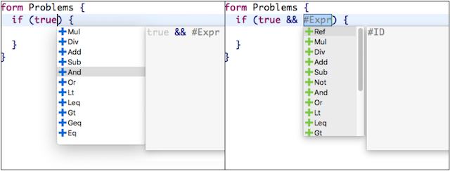
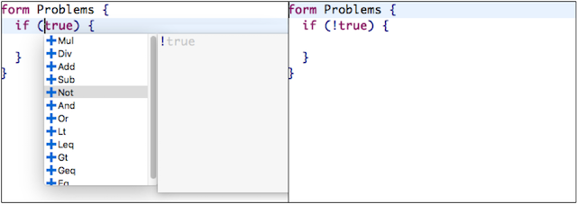
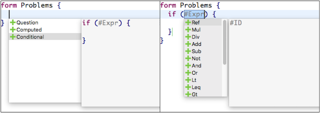
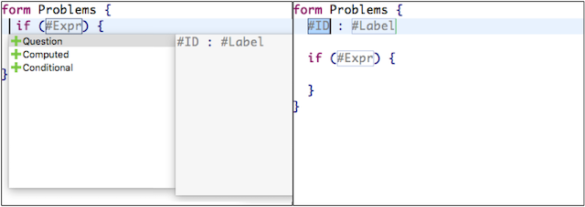
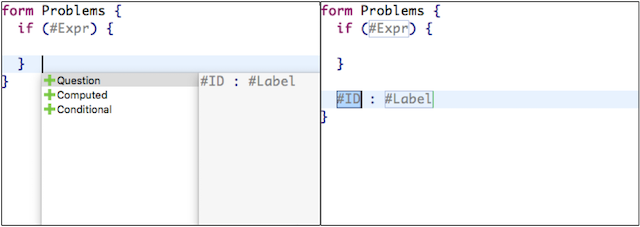
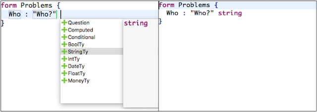
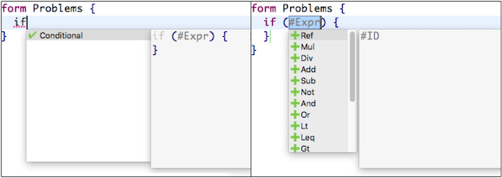
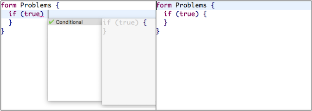
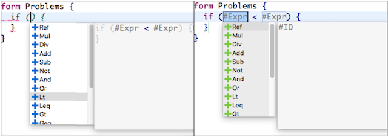

```eval_rst
.. _new-completion-framework-migration-guide: 
```

# New Completions Framework

In the latest Spoofax, we provide (beta) support for syntactic code completion.

Code completion can happen in three ways: expanding an explicit placeholder, expanding recursive structures, lists or nullable structures, and finishing a structure that has part of it already in the program and thus contains a syntax error due to missing symbols.

#### Expanding an explicit placeholder

Programs may contain explicit placeholders to represent incomplete structures. When positioning the cursor inside a placeholder and triggering code completion, the editor shows proposals in a pop-up and each proposal represents a placeholder expansion. Each non-terminal in the syntax definition generates a placeholder, and a placeholder can appear wherever the non-terminal can appear in the program. Users are able to edit the format of a placeholder (to avoid clashes with actual elements of the language) by editing the YAML file in the project. For example, if the yaml file contains the following lines:

    language:
      sdf: 
        placeholder:
          prefix: "#"
          suffix: "#"

  all placeholders in the program are going to be `#NAME#`, where `NAME` is the name of the non-terminal that the placeholder represents. Suffix are not mandatory and if no configuration is specified, placeholders will be formatted as `[[NAME]]`.

```eval_rst
.. note:: It is necessary to clean the project after changing the format of placeholders in the YAML file.
```

An example of completing a program by expanding a placeholder is shown below:


In this case, the explicit placeholder `#Expr` can be extended by any of the shown proposals. When selecting the proposal `Eq` the placeholder is replaced by `#Expr == #Expr` and the process of completing the program continues with the next placeholder in the program.

#### Expanding recursive, lists and nullable structures

Code completion may also allow extending the program when the cursor is at specific terms - recursive terms, lists or nullables - by term transformation. In the case of recursive terms, if a term is left-recursive and the cursor is positioned at the right of the term (considering its surrounding layout), we use the current term as the as the leftmost child in any of the left recursive productions of the same sort. We show an example to illustrate this scenario below. In the example we expand the boolean expression `true` by triggering completion after the expression, transforming it into an `And` term, and therefore turning `true` into `true && #Expr`.  



Similarly, we can expand terms considering its right recursive productions. The example below shows how to expand the boolean expression `true` into its negation `!true` using syntactic code completion.



It is also possible to use syntactic code completion to add elements to lists in the program by positioning the cursor inside the list (considering the list's surrounding layout). In the example below, the completion framework adds an element to an empty list, before or after another element.

##### Empty list



##### Adding before



##### Adding after



```eval_rst
.. note:: When adding an element to a list the separator is inferred from the grammar and automatically added.
```

Finally, syntactic code completion can also insert nullable/optional nodes that are not present in the program. For example, consider an optional **Type** at the end of a **Question**. When triggering completion at the layout after a question, like in the example below, it is possible to add the optional type (and also another element to the list of questions, as the layout of the list and the optional terms overlap).

 

#### Syntactic completion as error recovery

Programs might already contain part of a structure in the input and thus a syntax error. For erroneous programs, syntactic code completion offers all possible ways to finish a structure by adding missing symbols at the cursor position. For example, by typing `if` and triggering code completion, the framework proposes completing the program by inserting an `if` statement.

 

Completion as recovery can also add only lexical symbols to fix the program. In the example below, syntactic code completion fixes the if statement by adding the opening `{`.



When a single placeholder is necessary to fix the program, the completion framework shows all placeholder expansions as proposals.

 

```eval_rst
.. note:: Proposals are formatted according to SDF3 productions.
```

#### How to migrate old projects?

New projects come automatically with support for the new completions framework.
To migrate old projects it is necessary to:

- add the following imports to the main Stratego file:
	-  `completion/completion`. This imports the Stratego library for syntactic code completion.
- add the following import to `<LanguageName>-Colorer.esv`:
    - `completion/colorer/<LanguageName>-cc-esv`. This import the editor files responsible for coloring the explicit placeholders. 

In case of any issue or suggestion for improving the framework, please create an entry detailing your suggestion/issue with a tag `completion` in [http://yellowgrass.org/project/SpoofaxWithCore](http://yellowgrass.org/project/SpoofaxWithCore).
