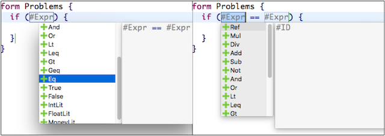

# New Completions Framework

In the latest Spoofax, we provide (beta) support for content completion on syntactic correct programs. 

On such programs, the completion service can be invoked to add elements to lists or to add missing terms. Furthermore, programs can contain explicit placeholders and be in an incomplete state. The completion service can be triggered on these placeholders to further extend the program.

An example is shown below:

In this case, the explicit placeholder `[[Statement]]` can be extended by any of the shown completion suggestions.

New projects come automatically with support for the new completions framework.
To migrate old projects it is necessary to:

- add the following imports to the main Stratego file:
	-  `completion/-`. This imports all the stratego files, generated from the SDF3 grammar.
	- `runtime/completion/-`. This imports the completion framework, part of the runtime-libraries.
- add the following strategy to the trans/pp.str file: 
	- `pp-completion = pp-partial-<LanguageName>-string`
- add the following import to `<LanguageName>-Colorer.esv`:
    - `completion/colorer/<LanguageName>-cc-esv`. This import the editor files responsible for coloring the explicit placeholders.

Currently, completion should only work properly for correct/incomplete programs. Completion for incorrect programs should happen soon, and also more IDE support. In case of any issue or suggestion for improvement, please report in http://yellowgrass.org/project/SpoofaxWithCore.